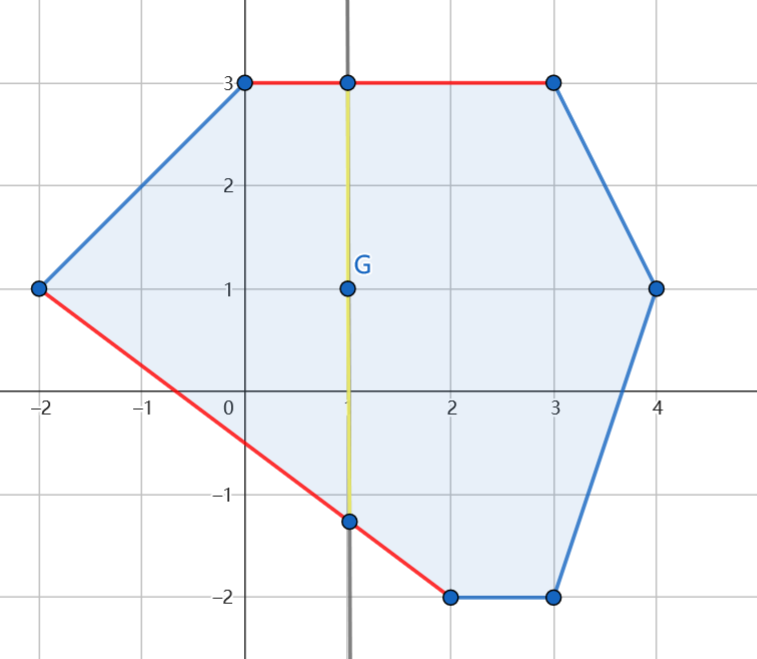

鸣谢 lengli 给出的图和第二种方法。

### 方法一：割线法

**提示 1：** 我们先考虑一个比这题更简单的问题：判断一个点是否在凸多边形内（严格内部）。

**提示 2：** 如何使得上述过程在单点检查的复杂度足够低，使得可以在多点的情况下能够完成任务？


上述提示的第一个问题，其实是几何中点在图形内的一个经典问题。

一般的处理方式是，经过这个点作一条射线，看这条射线与图形的边界有几个不同的交点。如果交点个数是奇数，则在图形内部，否则在图形外部（在取的直线不经过多边形顶点时，否则对应顶点需要处理一下）。

这种做法可以适用于任意多边形，但是单次检查的成本是 $\mathcal{O}(n)$ 的，在这题无法直接使用。

但是我们这题的外部多边形有性质：是凸的。

于是，我们可以保证无论如何这条射线只可能与多边形边界有一个交点。如果我们能够快速找到是否有交点，我们就可以很快解决问题。

我们考虑特殊射线：直接向 $y$ 轴正方向作射线。则这条与这条射线相交的只可能是横坐标范围包含当前点横坐标的线段。

于是，由于图形是凸的，这样的线段只有两条，也就方便了我们进行判断。

我们用另一种方式表述上面的方法。

我们过需要判断的点作一条垂直于 $x$ 轴的直线，考虑其与多边形的交点，再看我们要判断的点是否在两个交点之间，如图所示。



而这两条线段的寻找可以通过在上边缘和下边缘的线段集合中进行二分得到。注意题目中给出的凸多边形是顺时针给出点的，所以只需要找到其中坐标字典序最大 / 最小的点即可找到上下边缘的端点，进而直接得到上下边缘。

除此之外，需要特判横坐标不大于左边界 / 不小于右边界的情况，整体复杂度为 $\mathcal{O}(n+m\log n)$ .

#### 具体代码如下（只包含中间处理部分）——

```Python []
def main():
    n = II()
    pts = []
    for _ in range(n):
        x, y = MII()
        pts.append((x, y))
    
    mini_idx = pts.index(min(pts))
    maxi_idx = pts.index(max(pts))

    if maxi_idx > mini_idx:
        higher = pts[mini_idx:maxi_idx+1]
        lower = pts[maxi_idx:] + pts[:mini_idx+1]
    else:
        higher = pts[mini_idx:] + pts[:maxi_idx+1]
        lower = pts[maxi_idx:mini_idx+1]
    lower.reverse()

    mini_x = min(x for x, y in pts)
    maxi_x = max(x for x, y in pts)
    
    m = II()
    for _ in range(m):
        x, y = MII()
        if x <= mini_x or x >= maxi_x: print('NO'); return
        p1 = bisect.bisect_left(higher, (x, y))
        x1, y1 = higher[p1-1]
        x2, y2 = higher[p1]
        if (x - x1) * (y2 - y1) <= (y - y1) * (x2 - x1):
            print('NO')
            return
        p2 = bisect.bisect_left(lower, (x, y))
        x1, y1 = lower[p2-1]
        x2, y2 = lower[p2]
        if (x - x1) * (y2 - y1) >= (y - y1) * (x2 - x1):
            print('NO')
            return
    print('YES')
    return
```

---

### 方法二：凸包

**提示 1：** 给定多边形 $A$ 为什么强调是凸多边形？

**提示 2：** 尝试在多边形 $A$ 的基础上添加一个点，观察发生了什么变化？

**前置知识：** 关于凸包求解算法与基础概念，请参考 [凸包相关知识](https://oi-wiki.org/geometry/convex-hull/) 。


我们考虑上图对应情况，$G$ 与 $J$ 分别是两个属于 $B$ 多边形对应点集中的点，其中 $G$ 出现在了 $A$ 凸包内部，$J$ 出现在了外部。

不难发现 $G$ 的出现并没有使原凸包发生改变，而 $J$ 的出现，则需要断开原有边 $K-L$ ，链接 $K-J$ 与 $J-L$ 两条新边。即使得原有凸包形状发生了改变。所以如果将 $B$ 中所有点依次加入后，凸包形状没有发生变化，我们可以断定 $B$ 中的所有点均不在 $A$ 多边形外部。

此时我们还需要考虑 $B$ 中的点出现在 $A$ 边上的情况。我们可以观察一下普通凸包算法的运行过程，对于共线的多个点，构成的凸包仅保留了最两侧的顶点，那么很明显在此题中是不正确的，因为 $B$ 中的点可能在原凸包的某条边上。

我们可以对构造凸包过程进行细微的改动，使得共线的所有点全部保留，这样即可保证，如果存在 $B$ 上一点 $p$ 位于构成凸包的某条边上，则 $p$ 一定会被放入凸包集合。那么就顺利的解决了 $B$ 中的点出现在 $A$ 边上的情况

那么我们只需要将两个多边形的点合并，并记录每个点原先属于哪个多边形之后，使用 $Graham$ 或 $Andrew$ 构造凸包后，判断构成此凸包的点中是否包含原先属于多边形 $B$ 的点即可。复杂度瓶颈为凸包算法中的排序，故最终时间复杂度为 $\mathcal {O}((n+m)\log(n+m))$ 。