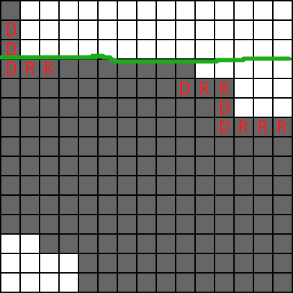
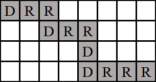
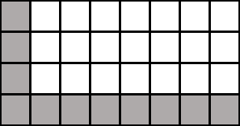

**提示 1：** 如果到某个位置 $i$ 的时候，前面只有一种操作，那么前 $i$ 个操作不会改变。

**提示 2：** 如果我们到某个位置的时候，前面既有 `R` 又有 `D` ，剩下的线路中的每一个点都可以任意向右向下移动，只要后续路径不超过 $n\times n$ 的范围。

**提示 3：** 考虑提示 2 中自由的那些点，其覆盖的位置如何？你能找到规律吗？

我们先看提示 1，如果一个位置 $k$ 前只有一种操作，则如果我们复制这 $k$ 个操作中的一个，那么前 $k$ 个位置仍然是同一种操作。因此这些操作永不改变。

而一旦出现了两种操作，剩下的位置都是自由的，因为此前有了 `R` 和 `D` 操作，因此可以通过将 `R` 替换为 `RR` 让这个点右移，将 `D` 替换为 `DD` 让这个点下移。

因此我们可以把所有点进行分类，一类是自由的，一类是不自由的，由该位置往前是否有两种不同的操作决定。下面是一个例子，其中所有红色的字母是给出的操作。



图中，绿线往上的个点都是不自由的，下面的点都可以随意走动。

绿线往下，发现不能走到的白色区域只会在右上角和左下角。而能走到的灰色部分就等于总面积减去没法走到的面积。

那么这两块白色区域怎么刻画呢？

右上角相当于曲线不断右移得到，左下角相当于曲线不断下移得到。于是，考虑左上角的每一行有多少不可达的点，相当于考虑后面的操作中 `R` 的个数。

例如第一行，后面还有 $5$ 个 `R` 操作，因此留下了 $5$ 个空格。第三行，后面还有 $3$ 个 `R` 操作，因此留下了 $3$ 个空格。

左下角也是一样，只需要看 `L` 操作的个数即可。

用上面的方法可以完成计数，但是可以发现左上角和右下角可以拼成下面的图形：



而这个图形中的路径恰好是后续进行的所有操作。其路径长度很容易计算，且总面积很容易计算，因此本题可以通过总面积减去中间路径的长度进一步得到白色区域面积。

进一步地，我们可以把灰色区域移动成这样：



这样就直接拼成矩形了，这个矩形的面积只和之后进行的横向和纵向操作数量有关。

注意一个特殊的点，如果整个字符串只有一种操作，那么答案只能是 $n$ ，直接输出即可（题目很友善地给了对应的例子）。

时间复杂度为 $\mathcal{O}(|s|)$ ， $|s|$ 为操作字符串长度。

#### 具体代码如下（只包含中间处理部分）——

```Python []
def main():
    n = II()
    s = I()
    
    k = len(s)
    
    pos = -1
    for i in range(k):
        if s[i] != s[0]:
            pos = i
            break
    
    if pos == -1:
        return n

    ans = pos + (n - pos) * n
    
    dx, dy = 0, 0
    for i in range(pos, k):
        if s[i] == 'R': dy += 1
        else: dx += 1
    
    ans -= dx * dy
    return ans
```